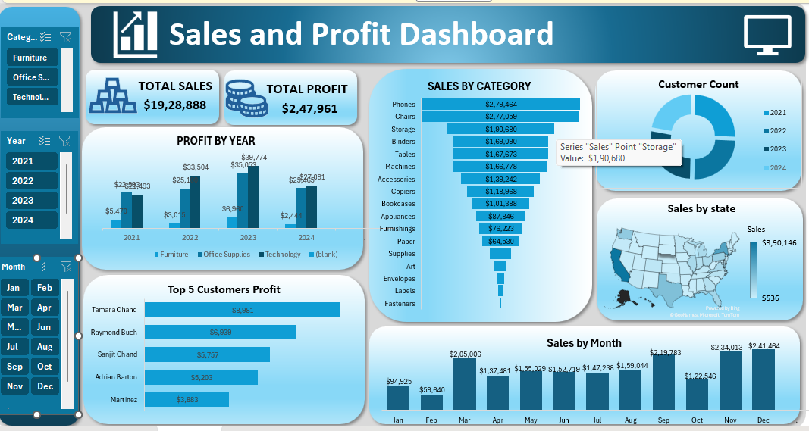

# 📊 Sales & Profit Dashboard (Excel Project)

## 📌 Project Overview
This project is an interactive **Sales and Profit Dashboard** built using Microsoft Excel to analyze sales performance and profit trends.

The dashboard provides insights into sales by category, customer profit contribution, yearly profit performance, and regional sales distribution.

---

## 🛠 Tools Used
- Microsoft Excel
- Pivot Tables
- Pivot Charts
- Slicers
- Data Visualization

---

## 📊 Dashboard Features
✔ Total Sales and Total Profit summary  
✔ Sales by Category analysis  
✔ Profit by Year comparison  
✔ Top 5 Customers by Profit  
✔ Sales by State visualization  
✔ Monthly Sales Trends  

---

## 🎛 Interactive Filters
The dashboard includes **Slicers** to filter data by:

- Category
- Year
- Month

This makes the dashboard interactive and easy to explore.

---

## 📷 Dashboard Preview

---

## 🧠 Skills Demonstrated
- Data Cleaning
- Data Analysis
- Dashboard Design
- Data Visualization
- Business Insights

---

## 👩‍💻 Author
Ponni  
Aspiring Data Analyst | Excel & Data Visualization
